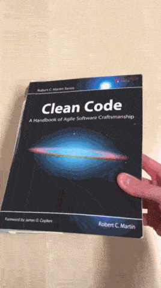
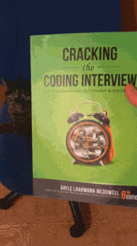
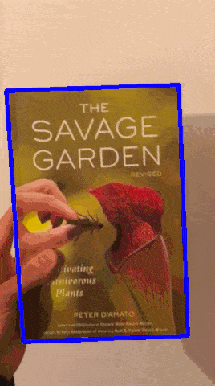

# docdetect

[](https://travis-ci.org/alessandrozamberletti/docdetect)
[](https://ci.appveyor.com/project/alessandrozamberletti/docdetect/branch/master)
[](https://codecov.io/gh/alessandrozamberletti/docdetect)
[](https://codeclimate.com/github/alessandrozamberletti/docdetect/maintainability)

<p align="center"> 
  
  
  
</p>

# Installation

TBD

# Examples

```python
import docdetect

rects = docdetect.process(image)
image = docdetect.draw(rects, image)
```

# Resources  
* [Fast and Accurate Document Detection for Scanning](https://blogs.dropbox.com/tech/2016/08/fast-and-accurate-document-detection-for-scanning/)
